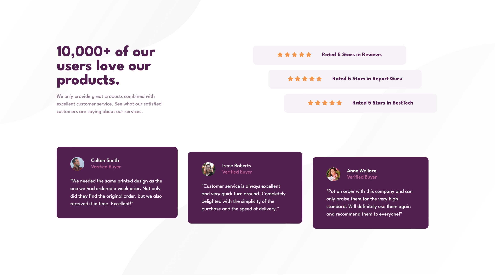
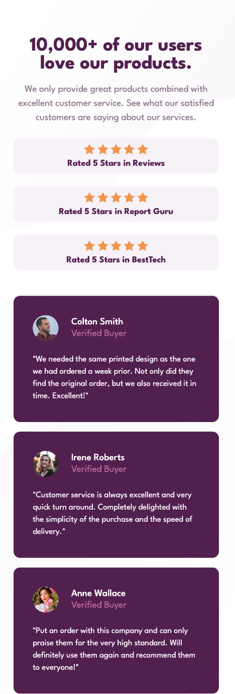

# Frontend Mentor - Social Proof Section Solution

This is a solution to the [social proof section challenge on Frontend Mentor](https://www.frontendmentor.io/challenges/social-proof-section-6e0qTv_bA). Frontend Mentor challenges help you improve your coding skills by building realistic projects.

## Table of contents

- [Overview](#overview)
  - [The challenge](#the-challenge)
  - [Screenshots](#screenshots)
  - [Links](#links)
- [My process](#my-process)
  - [Built with](#built-with)
  - [Layout](#layout)
- [Author](#author)

## Overview

### The challenge

Users should be able to:

- View the optimal layout depending on their device's screen size

### Screenshots

### Links

- Solution URL: [Frontend Mentor](https://www.frontendmentor.io/solutions/responsive-social-proof-section-eGmlR9F_LG)
- Live Site URL: [Vercel](https://social-proof-section-nesdevs.vercel.app)

## My process

### Built with

- Semantic HTML5 markup
- CSS custom properties
- Flexbox

### Layout

The designs were created to the following widths:

- Mobile: 375px
- Desktop: 1440px

## Author

- Frontend Mentor - [@Reallyvane](https://www.frontendmentor.io/profile/Reallyvane)
- Twitter - [@OfficialNesDevs](https://twitter.com/OfficialNesDevs)
